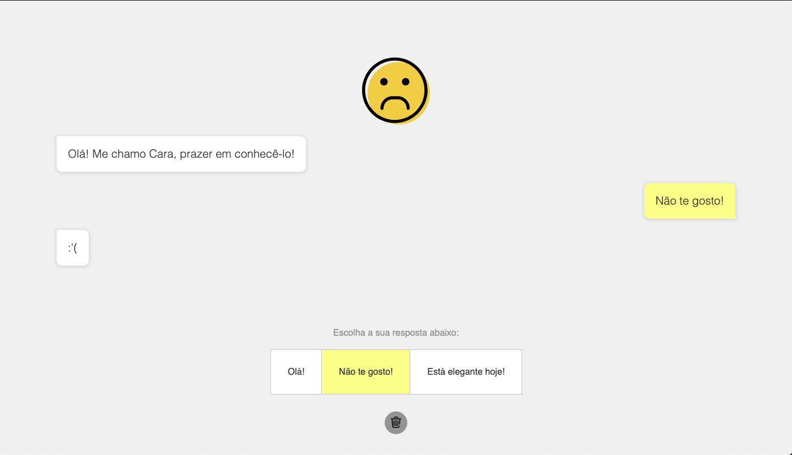

# EXERCÍCIO AMIGO

## Descrição

> Para a execução deste exercício crie uma pasta chamada `amigo` dentro da sua pasta do curso/turma.

> ATENÇÃO: Para a implementação, utilize apenas HTML e CSS e JavaScript

Crie os seguintes arquivos `amigo.html`, `estilo.css` e `script.js`. O resultado final do `HTML` + `CSS` deve ser como abaixo:

A sequencia dos cliques dos botões e suas ações estão ilustradas abaixo:

> *Ao clicar na lixeira (utilize a tag `button` com a imagem `img` dentro) volta ao estado inicial

> As cores utilizadas são:
> - Fundo da página `#f0f0f0`
> - Cor do texto: `rgb(50, 50, 50)`
> - Cor do texto claro: `rgb(147, 147, 147)`
> - Cor da borda dos botões: `rgb(196, 196, 196`
> - Cor de fundo do botão: `white`
> - Cor de fundo do botão (no hover): `rgb(255, 251, 141)`
> - Cor de fundo do balão branco: `white`
> - Cor de fundo do balão branco: `rgb(255, 251, 141)`
> - Cor do botão da lixeira: `rgb(147, 147, 147)`
> Os ícnoes e imagens podem ser baixadas aqui:
> - Ícone de lixeira: https://www.flaticon.com/free-icon/trash_748023?term=trash&page=1&position=49
> - Imagens do rosto: https://www.flaticon.com/packs/color-emotions-assets

## Referências

> Atenção: **SEMPRE** verifiquem se o código que você está consultando não foi traduzido pelo seu navegador, isso lhe causar muitos problemas! ; )

- getElementById: [https://developer.mozilla.org/pt-BR/docs/Web/API/Document/getElementById](https://developer.mozilla.org/pt-BR/docs/Web/API/Document/getElementById)

- Propriedade `src` da imagem (JS): [https://www.w3schools.com/jsref/prop_img_src.asp](https://www.w3schools.com/jsref/prop_img_src.asp)