# EXERCÍCIO CALCULADORA UI

## Descrição

> Para a execução deste exercício crie uma pasta chamada `calculadora-ui` dentro da sua pasta do curso/turma.

> ATENÇÃO: Para a implementação, utilize apenas HTML e CSS e JavaScript

Crie os seguintes arquivos `calculadora.html`, `estilo.css` e `script.js`. O resultado final do `HTML` + `CSS` deve ser como abaixo:

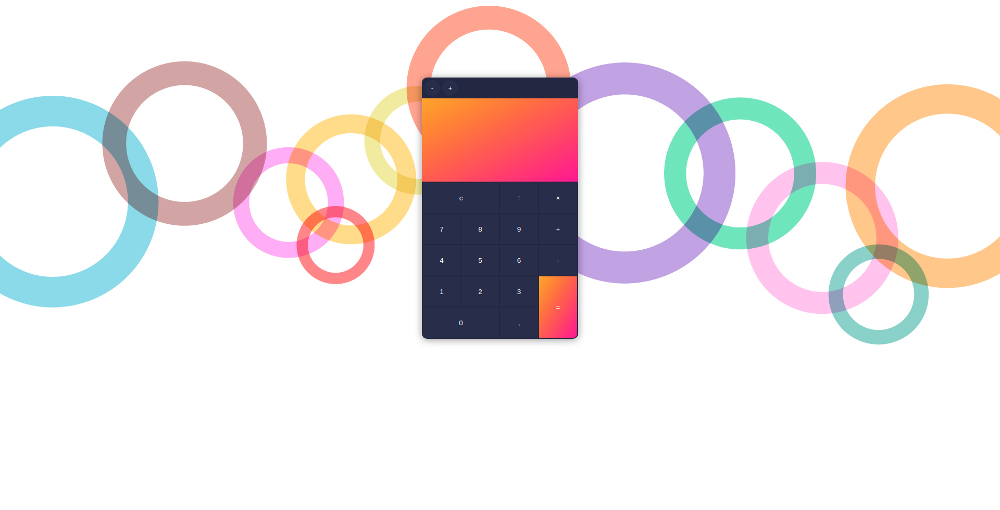

Atente-se aos detalhes da calculadora:

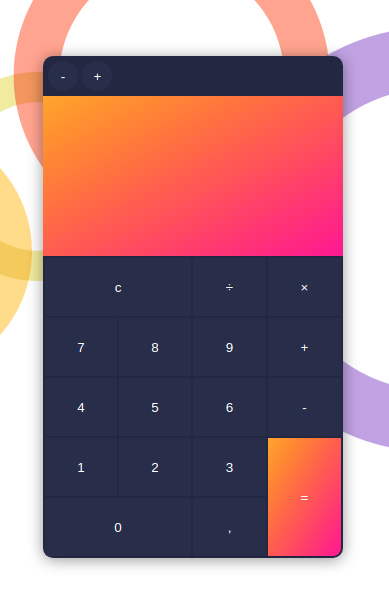

Para implementação da área dos botões da calculadora utilize a tag HTML `table`.

Os botões com números, e os com operadores aritméticos (+, -, ×, ÷) ao serem clicados, deve ser montado a expressão no campo de resultado. Por exemplo: se eu clicar nos botões: `2`, `+` e `5`, o resultado deve ser:

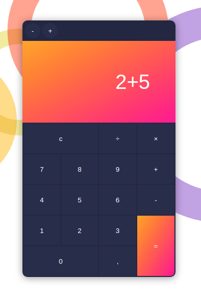

Ao clicar no botão `=` a expressão que foi digitada, deve ser avaliada como JavaScript (`eval`) e o resultado exibido no campo de resultado. Supondo o caso anterior (2+5) se eu clicar no botão `=`, o resultado deve ser:

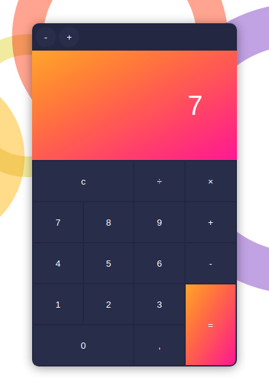

Ao clicar no botão `c` todo o texto presente no campo de resultado deve ser limpo. Se eu clicar no botão `c`, o resultado deve ser:

Quando qualquer botão for clicado (estado `active` do CSS) a cor de fundo deve assumir o valor `#242742`, como ilustrado abaixo.

Ao clicar no botão `7`:

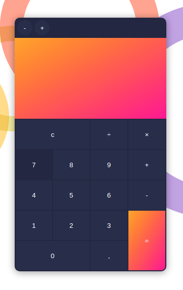

Ao clicar no botão `c`:

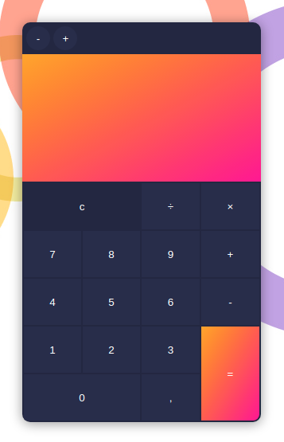

Ao clicar no botão `=`:

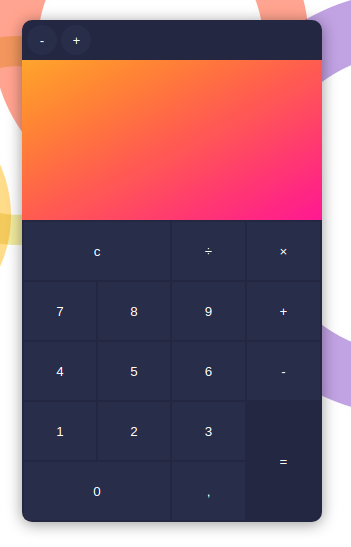

ATENÇÃO: Isso deve acontecer ao clique de qualquer botão do corpo da calculadora:

Quando o texto no campo resultado "crescer" demais, a ponto dele "vazar" a largura do elemento pai (`overflow-x`) uma barra de rolagem horizoltal customizada deve aparecer (`overflow-x: scroll`). A barra de rolagem vertical do campo de resultado não deve aparacer (`overflow-y: none;`). Veja `CSS Overflow` nas referências.

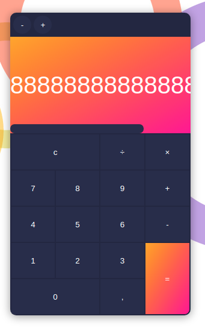

Os botões acima do campo de resultado não possuem funcionalidade, são apenas um recurso visual.

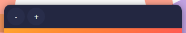

Atenção ao valor que deve ser escrito no campo de resultado ao clicar nos botões: `×`, `÷` e `,`. Seus valores escritos devem ser, respectivamente: `*`, `/` e `.`. Por exemplo se eu clicar nos seguintes botões em sequência: `2`, `,`, `5`, `×`, `2`, `0`, `÷`, `1`, `0` e `0`, o texto campo resultado deve ser:

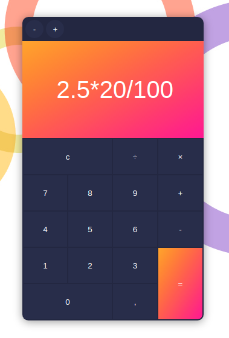

E o resultado do cálculo: 

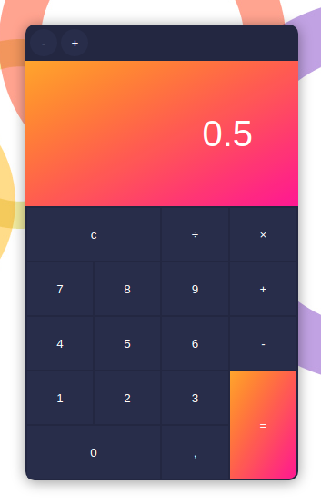

> Cores e imagens utilizadas:
> - Imagem de fundo: https://eskipaper.com/images/circle-background-4.jpg
> - Cor do texto: `white`
> - Cor da fundo dos botões: `#292d4b`
> - Cor de fundo da tabela: `#242742`
> - Cor de fundo do campo de resultado: Gradiente Linear das cores `orange` e `deeppink` com direcionamento diagonal (`to right bottom`)

## Referências

> Atenção: **SEMPRE** verifiquem se o código que você está consultando não foi traduzido pelo seu navegador, isso lhe causar muitos problemas! ; )

- HTML Table: https://www.w3schools.com/html/html_tables.asp
- HTML Table `colspan` e `rowspan`: https://html.com/tables/rowspan-colspan/
- CSS Overflow: https://www.w3schools.com/css/css_overflow.asp
- CSS do Scrollbar (barra de rolagem): https://www.w3schools.com/howto/howto_css_custom_scrollbar.asp