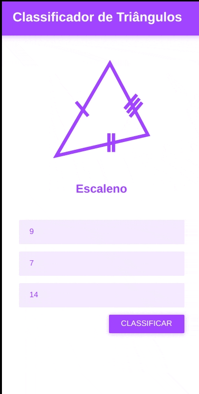
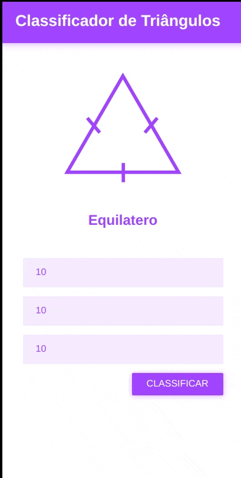
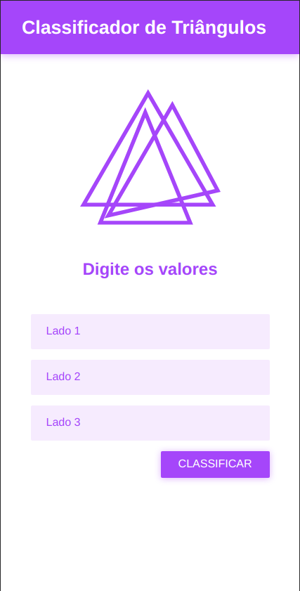
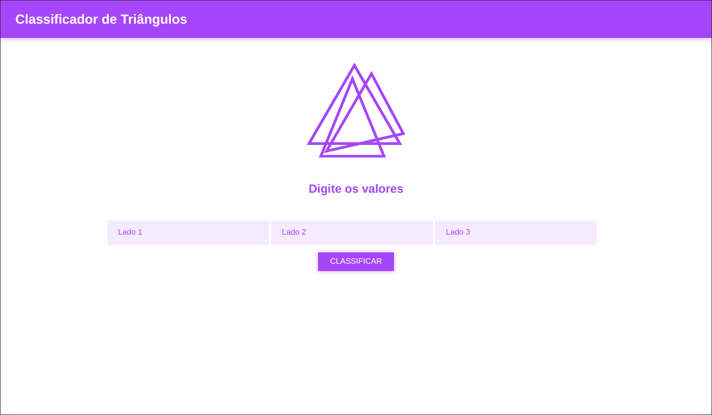

# EXERCÍCIO CLASSIFICADOR DE TRIÂNGULOS

## Descrição

> Para a execução deste exercício crie uma pasta chamada `classificador-triangulos` dentro da sua pasta do curso/turma.

> ATENÇÃO: Para a implementação, utilize apenas HTML e CSS e JavaScript

Crie os seguintes arquivos `classificador.html`, `estilo.css` e `script.js`. O resultado final do `HTML` + `CSS` deve ser como abaixo:

Crie uma tela contendo três campos numéricos e um botão, para analisar o tipo do triângulo. Após o usuário clicar em "Classificar" o sistema deve comparar os lados dos triângulos e classificá-los em: Equilátero (todos os lados iguais), Escaleno (todos os lados diferentes) ou Isóceles (dois lados iguais).

O sistema deve fazer as validações dos campos digitados, todos os campos devem são obrigatórios.

O sistema deve ser responsivo, seu layout deve ser usável, tanto em dispositivos menores (smartphones, tablets) quanto dispositivos maiores (laptops e desktops).

Mobile:

Desktop:

> Cores e imagens utilizadas:
> - Roxo: `#a144ff`
> - Roxo Claro: `rgb(219, 183, 255);`
> - Cor de sombra: `rgba(161, 66, 255, 0.4)`

## Referências

> Atenção: **SEMPRE** verifiquem se o código que você está consultando não foi traduzido pelo seu navegador, isso lhe causar muitos problemas! ; )

- If...Else: https://developer.mozilla.org/pt-BR/docs/Web/JavaScript/Reference/Statements/if...else
- Decisões condicionais: https://developer.mozilla.org/pt-BR/docs/Learn/JavaScript/Building_blocks/conditionals