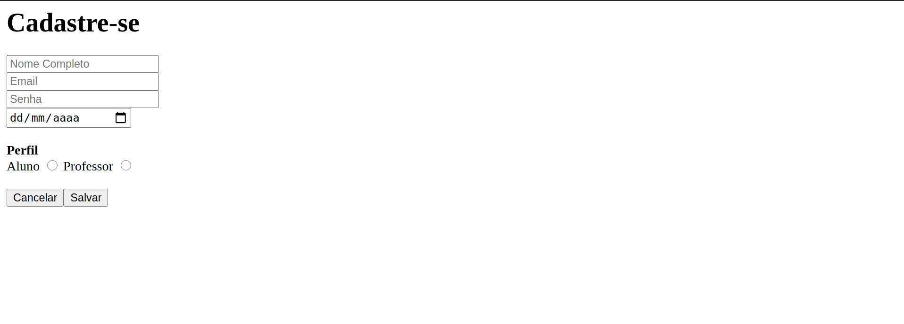

# EXERCÍCIO FORMULÁRIO CADASTRO

## Descrição

> Para a execução deste exercício crie uma pasta chamada `formulario-cadastro` dentro da sua pasta do curso/turma.

Crie um arquivo chamdo `cadastro.html` e crie uma página de cadastro conforme a imagem abaixo:

OBS:

- Utilize o atributo `type` do `input` de acordo com cada tipo de entrada (ex: `type="email"` para o campo email, `type="password"` para o campo senha, etc...)
- Para quebra de linha, utilize a tag ` `
- Par a seleção de perfil, utilize a tag `<input type="radio">`

> ATENÇÃO: Para a implementação, utilize apenas **HTML**

## Referências

> ATENÇÃO: **SEMPRE** verifique se o código que você está consultando não foi traduzido pelo seu navegador, isso pode lhe causar muitos problemas! ; )

- Tag `input`: [https://developer.mozilla.org/pt-BR/docs/Web/HTML/Element/input](https://developer.mozilla.org/pt-BR/docs/Web/HTML/Element/input)

- Input Radio: [https://developer.mozilla.org/en-US/docs/Web/HTML/Element/input/radio](https://developer.mozilla.org/en-US/docs/Web/HTML/Element/input/radio)

## Links complementares

> ATENÇÃO: **SEMPRE** verifique se o código que você está consultando não foi traduzido pelo seu navegador, isso pode lhe causar muitos problemas! ; )