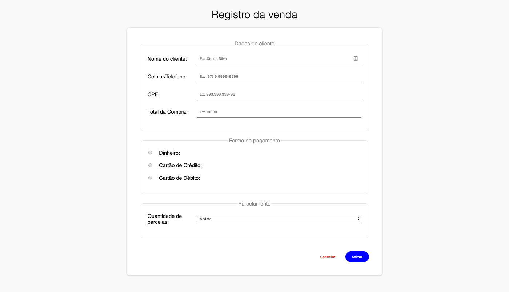
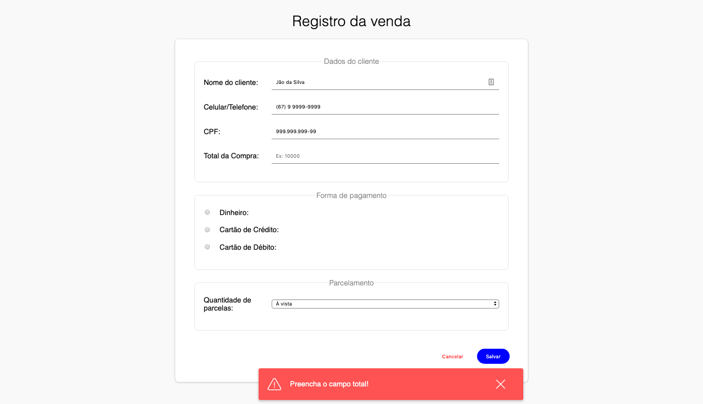
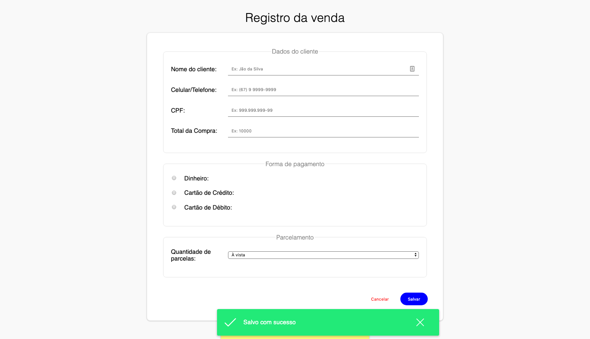
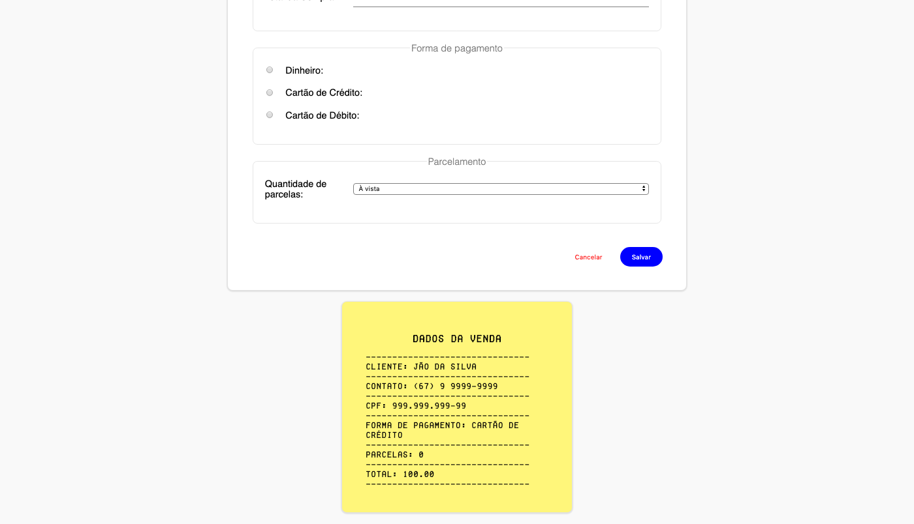

# EXERCÍCIO FRENTE DE CAIXA

## Descrição

> Para a execução deste exercício crie uma pasta chamada `frente-caixa` dentro da sua pasta do curso/turma.

> ATENÇÃO: Para a implementação, utilize apenas HTML e CSS e JavaScript

Crie os seguintes arquivos `caixa.html`, `estilo.css` e `script.js`. O resultado final do `HTML` + `CSS` deve ser como abaixo:



Crie validações campo-a-campo, com as interação como mostrado nas imagens abaixo:







Para o posicionamento do alerta como nas imagens, você deve colocar da tag do alerta (`div`, por exemplo) com o atributo CSS `position: absolute` e colocá-lo dentro do formulário. Além disso é necessário colocar a tag do formulário (`form`, por exemplo) com o atributo CSS: `position: relative`, isso faz com que possamos posicionar o nosso alerta em qualquer lugar da tela, tomando como referência o formulário (que tem o `position: relative`). Com isso feito, você pode movimentar livremente o alerta, por exemplo, se colocarmos o atributo CSS: `bottom: 0px` fazemos com que o alerta "encoste" no fundo do formulário.

Para conseguir o resultado das imagens basta colocar o `bottom: -40px` e `right: 10px`.

Após o alerta de sucesso, o formulário deve ser limpado.

Ao clicar no botão `Cancelar` o formulário deve ser limpado.

O exercício requer que você imprima um "cupom fiscal" da seguinte forma:



Para o "cupom" é necessário baixarmos e importarmos uma fonte externa. Para a importação da fonte, baixe a fonte no formato .ttf (turetype) no link: [https://dl.1001fonts.com/fake-receipt.zip](https://dl.1001fonts.com/fake-receipt.zip), coloque na pasta do exercício e utilize o seguinte código no seu arquivo CSS:

```css
@font-face {
  font-family: "FakeReceipt";
  src: url("fake_receipt.ttf") format("truetype");
}
```

Com isso feito, insira o código abaixo na classe do "cupom fiscal":

```css
font-family: "FakeReceipt", Fallback, sans-serif;
```

O código acima faz, basicamente, uma tentativa de carregar a fonte chamada `FakeReceipt` mas caso não dê certo (Fallback) ele configura a font `sans-serif`.

ATENÇÃO: Atente-se ao nome do arquivo, aqui está como `fake_receipt.ttf`, e para o `src` é importante dizer o nome exato do arquivo. Utilize o autocomplete do Visual Studio Code para ajudar ;D

> As cores utilizadas são:
> - Fundo da página: `#f9f9f9`
> - Cor de fundo do alerta de sucesso: `#22ea78`
> - Cor de fundo do alerta de erro: `#ff5252`
> - Cor de fundo do botão salvar: `blue`
> - Cor de texto do botão cancelar: `red`
> - Cor de fundo do "cupom fiscal": `rgb(255, 246, 122)`

> Os ícnoes e imagens podem ser baixadas aqui:
> - Ícone de check (sucesso): https://www.flaticon.com/free-icon/tick_446191?term=tick&page=1&position=10
> - Ícone de alerta (erro): https://www.flaticon.com/free-icon/alert_550096?term=danger&page=1&position=7#
> - Ícone de close (fechar): https://www.flaticon.com/free-icon/cancel_860796

## Referências

> Atenção: **SEMPRE** verifiquem se o código que você está consultando não foi traduzido pelo seu navegador, isso lhe causar muitos problemas! ; )

- Importação de fonte local: [https://css-tricks.com/snippets/css/using-font-face/](https://css-tricks.com/snippets/css/using-font-face/)

- CSS Position: [https://www.w3schools.com/css/css_positioning.asp](https://www.w3schools.com/css/css_positioning.asp)