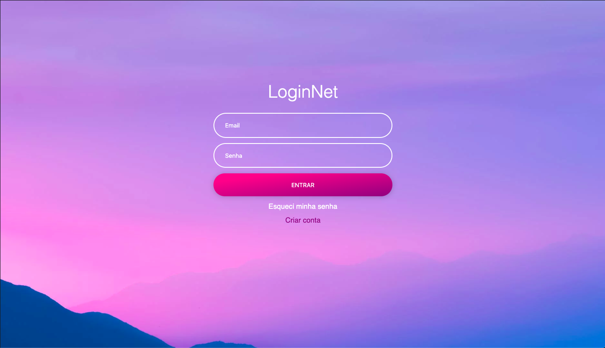

# EXERCÍCIO LOGIN NET

## Descrição

> Para a execução deste exercício crie uma pasta chamada `login-net` dentro da sua pasta do curso/turma.

Crie um arquivo chamdo `login.html` e crie uma página de login conforme a imagem abaixo:

> ATENÇÃO: Para a implementação, utilize apenas HTML e CSS

> Para imagem de fundo utilize o seguinte link: [https://images.pexels.com/photos/114979/pexels-photo-114979.jpeg?auto=compress&cs=tinysrgb&dpr=2&h=650&w=940](https://images.pexels.com/photos/114979/pexels-photo-114979.jpeg?auto=compress&cs=tinysrgb&dpr=2&h=650&w=940)

> As cores utilizadas são:
> - Rosa: `deeppink`
> - Roxo: `purple`
> - Branco: `white`

## Referências

> ATENÇÃO: **SEMPRE** verifique se o código que você está consultando não foi traduzido pelo seu navegador, isso pode lhe causar muitos problemas! ; )

- Imagem de fundo `background-image` do CSS: [https://www.w3schools.com/cssref/pr_background-image.asp](https://www.w3schools.com/cssref/pr_background-image.asp) e [https://developer.mozilla.org/pt-PT/docs/Web/CSS/background-image](https://developer.mozilla.org/pt-PT/docs/Web/CSS/background-image)

- Cor de fundo degradê `linear-gradient` do CSS: [https://www.w3schools.com/css/css3_gradients.asp](https://www.w3schools.com/css/css3_gradients.asp)

## Links complementares

> ATENÇÃO: **SEMPRE** verifique se o código que você está consultando não foi traduzido pelo seu navegador, isso pode lhe causar muitos problemas! ; )

- As 8 propriedade CSS para background e seus segredos (MAUJOR): [https://www.maujor.com/tutorial/propriedade-css-para-estilizacao-de-background.php](https://www.maujor.com/tutorial/propriedade-css-para-estilizacao-de-background.php)