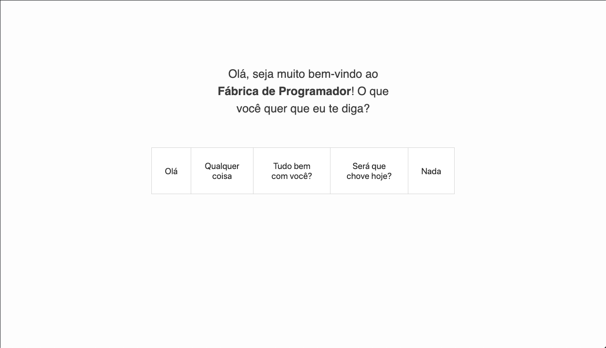
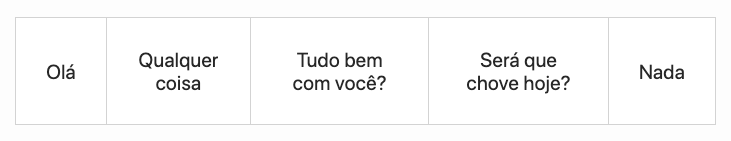
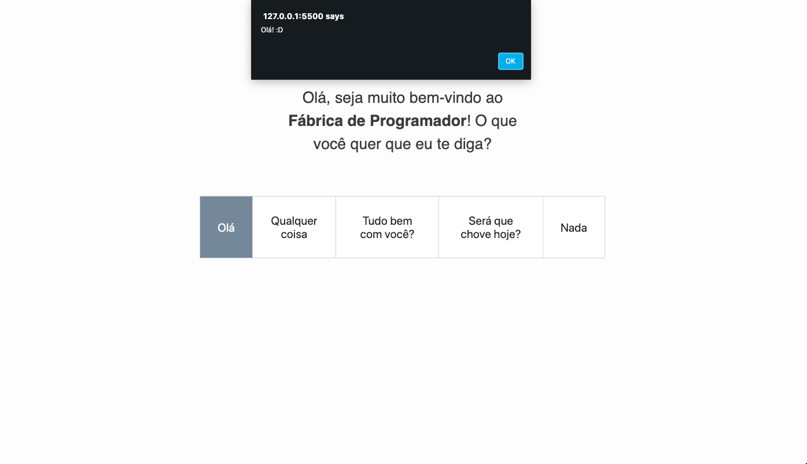
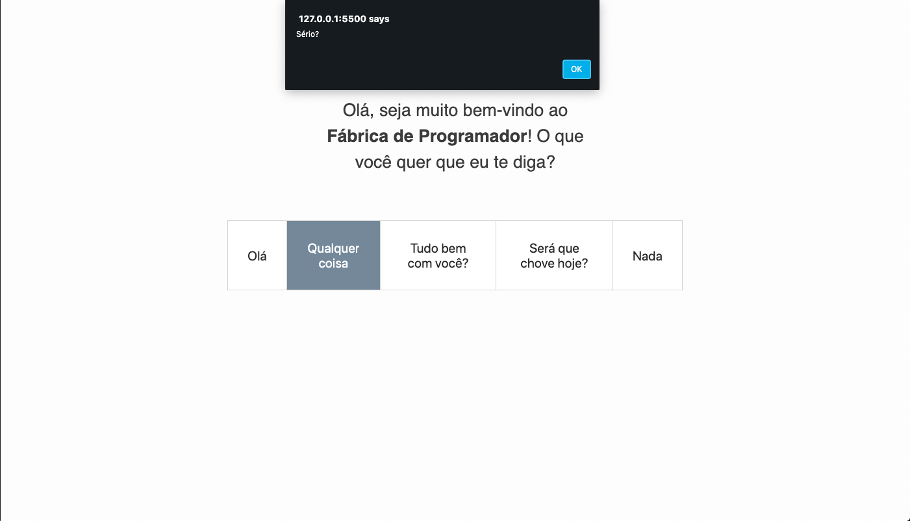
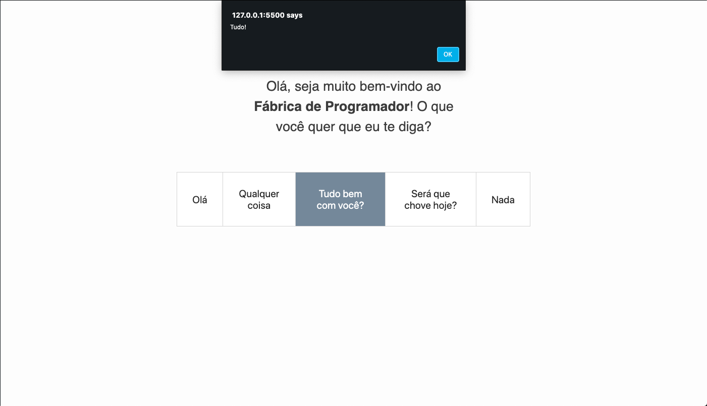
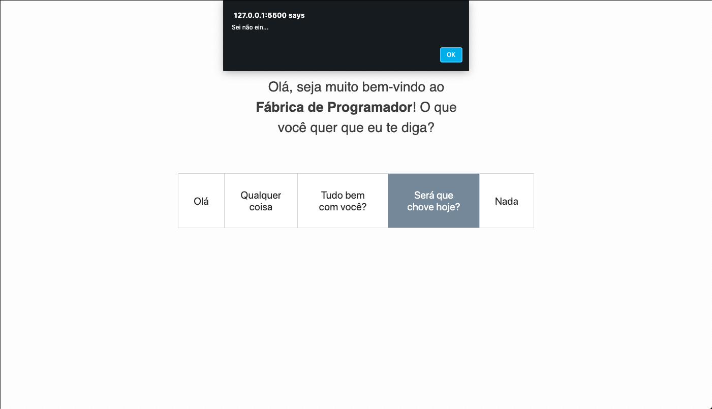
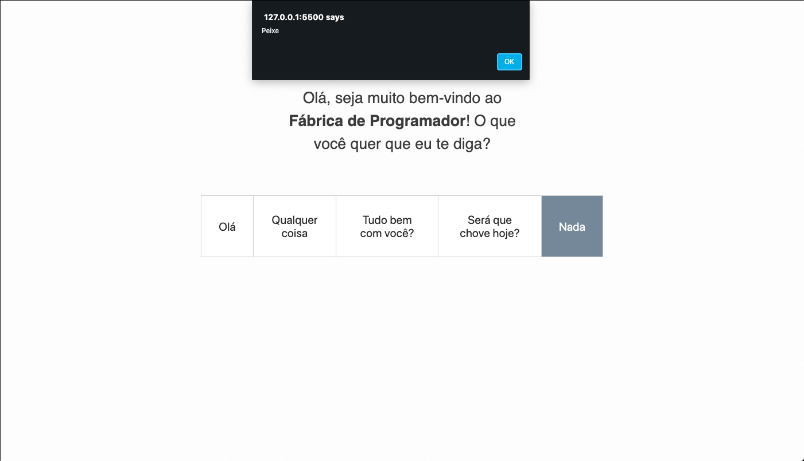

# EXERCÍCIO OLÁ JS

## Descrição

> Para a execução deste exercício crie uma pasta chamada `ola-js` dentro da sua pasta do curso/turma.

> ATENÇÃO: Para a implementação, utilize apenas HTML e CSS e JavaScript

Crie os seguintes arquivos `ola.html`, `estilo.css` e `script.js`. O resultado final do `HTML` + `CSS` deve ser como abaixo:

> Para implementar as ecolhas (imagem abaixo) utilize a tag `button`.

A sequencia dos cliques dos botões e suas ações estão ilustradas abaixo:

> Utilize a função `alert` para exibir os textos

> As cores utilizadas são:
> - Fundo da página `rgb(253, 253, 253)`
> - Cor do texto: `rgb(59, 59, 59)`
> - Cor da borda dos botões: `lightgray`
> - Cor do fundo do botão: `white`
> - Cor do fundo do botão (quando clicado): `lightslategray`

## Referências

> Atenção: **SEMPRE** verifiquem se o código que você está consultando não foi traduzido pelo seu navegador, isso lhe causar muitos problemas! ; )

- HTML Tag `strong` (negrito): [https://developer.mozilla.org/pt-BR/docs/Web/HTML/Element/strong](https://developer.mozilla.org/pt-BR/docs/Web/HTML/Element/strong)

- CSS `:active` (para mudar a cor do botão ao ser clicado): [https://developer.mozilla.org/pt-BR/docs/Web/CSS/:active](https://developer.mozilla.org/pt-BR/docs/Web/CSS/:active)