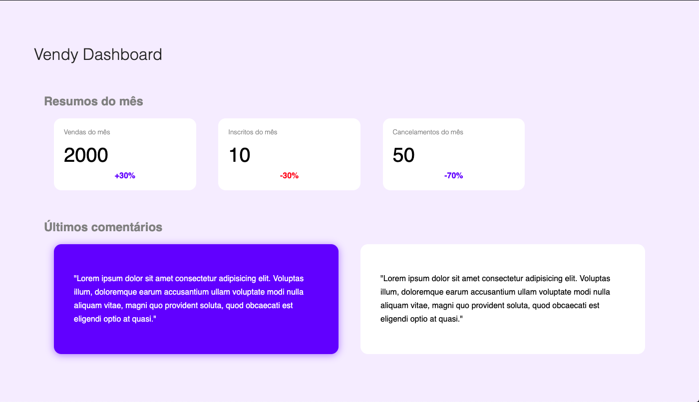

# EXERCÍCIO VENDY DASH

## Descrição

> Para a execução deste exercício crie uma pasta chamada `vendy-dash` dentro da sua pasta do curso/turma.

Crie um arquivo chamdo `dashboard.html` e crie uma página de *dashboard* conforme a imagem abaixo:

> ATENÇÃO: Para a implementação, utilize apenas HTML e CSS

> As cores utilizadas são:
> - Fundo da página: `rgb(243, 238, 255)`
> - Título princial: `rgb(37, 37, 37)`
> - Título secundário: `gray`
> - Azul do card de comentários e das porcetagens: `(70, 70, 255)`
> - Vermelho da porcentagem: `rgb(255, 62, 62)`
> - Cor da sonbra: `rgba(70, 70, 255, .5)`

## Referências

> Atenção: **SEMPRE** verifiquem se o código que você está consultando não foi traduzido pelo seu navegador, isso lhe causar muitos problemas! ; )

- Sombra no CSS (`box-shadow`): [https://developer.mozilla.org/pt-BR/docs/Web/CSS/box-shadow](https://developer.mozilla.org/pt-BR/docs/Web/CSS/box-shadow)

- Como fazer os elementos ficarem um do lado do outro (`display: inline-block`): [https://www.w3schools.com/css/css_inline-block.asp](https://www.w3schools.com/css/css_inline-block.asp)

- CSS `display` (para trabalhar na disposição dos elementos): [https://developer.mozilla.org/pt-BR/docs/Web/CSS/display](https://developer.mozilla.org/pt-BR/docs/Web/CSS/display)

- HTML Tag `div` (para fazer os cards): [https://developer.mozilla.org/pt-BR/docs/Web/HTML/Element/div](https://developer.mozilla.org/pt-BR/docs/Web/HTML/Element/div)

- HTML Tag `section` (para fazer as sessões de `Resumos do mês` e `Últimos comentários`): [https://developer.mozilla.org/pt-BR/docs/Web/HTML/Element/section](https://developer.mozilla.org/pt-BR/docs/Web/HTML/Element/section)

## Links complementares

> Atenção: **SEMPRE** verifiquem se o código que você está consultando não foi traduzido pelo seu navegador, isso lhe causar muitos problemas! ; )

- Pare de chutar e aprenda como funciona o display `inline-block`: [https://medium.com/collabcode/pare-de-chutar-e-aprenda-como-funciona-o-display-inline-block-4e6cba2f19d4](https://medium.com/collabcode/pare-de-chutar-e-aprenda-como-funciona-o-display-inline-block-4e6cba2f19d4)

- CSS `float` ou `inline-block`?: [https://pt-br.learnlayout.com/inline-block.html](https://pt-br.learnlayout.com/inline-block.html)

- Diferença entre o `float` e o `inline-block`: [https://pt.stackoverflow.com/questions/66393/qual-a-diferença-entre-displayinline-block-e-floatleft/66421#66421](https://pt.stackoverflow.com/questions/66393/qual-a-diferença-entre-displayinline-block-e-floatleft/66421#66421)